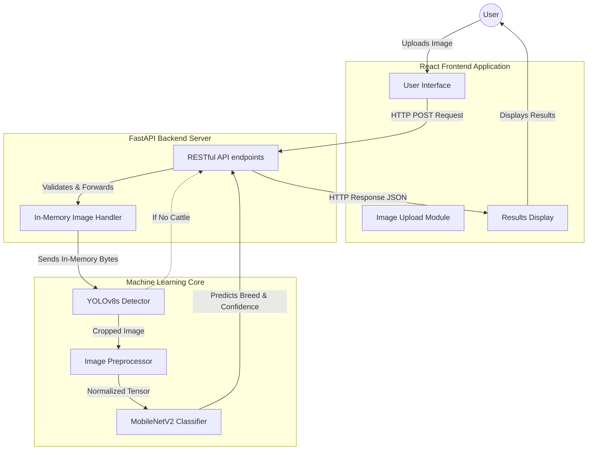
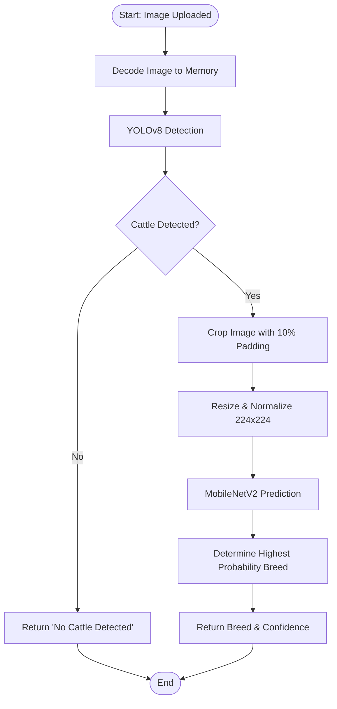
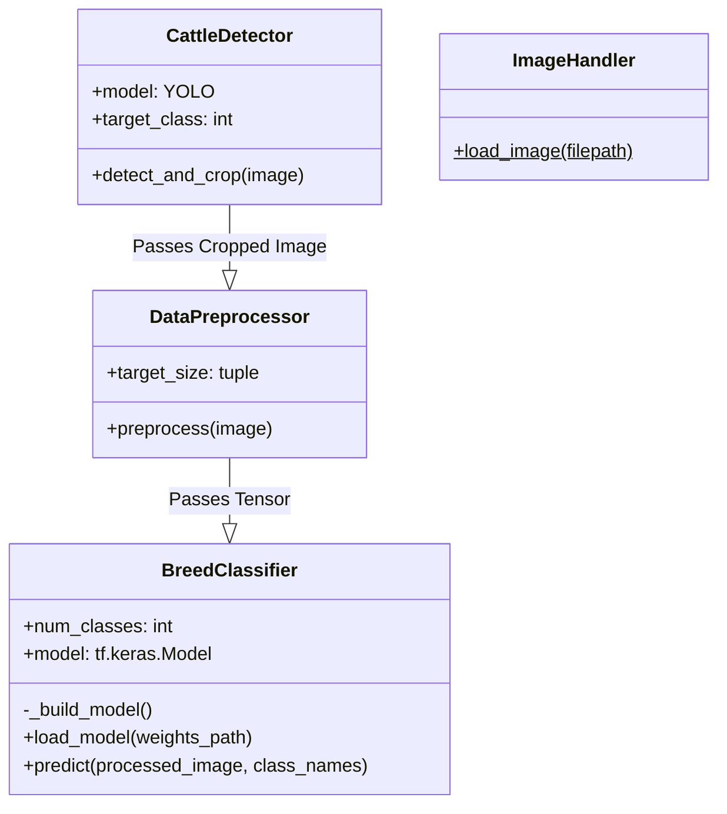

# Project Report: Cattle Breed Classification System

## 1. Abstract
The accurate identification of cattle breeds is a crucial component of modern livestock management and precision agriculture. This project presents an end-to-end Machine Learning web application designed to classify various Indian cattle breeds from images. To ensure high robustness, the system employs a two-step pipeline: an initial object detection phase using YOLOv8 to locate and crop cattle from complex backgrounds, followed by a classification phase using Transfer Learning with MobileNetV2. The solution features a decoupled architecture, incorporating a centralized ML Core, a high-performance FastAPI backend, and a modern React-based frontend to provide an intuitive user experience for single and multi-image breed prediction.

## 2. Introduction
### 2.1 Problem Statement
In the agricultural sector, identifying cattle breeds accurately is essential for breeding programs, health monitoring, and market valuation. Manual identification relies heavily on human expertise, which can be subjective, time-consuming, and error-prone. Additionally, field images often contain background noise, multiple animals, or irrelevant objects. There is a need for an automated, reliable, and accessible tool that can accurately isolate and classify cattle breeds using computer vision.

### 2.2 Objectives
* To develop a robust two-step deep learning pipeline for cattle detection and classification.
* To utilize YOLOv8 for accurate object detection and cropping of cattle from images.
* To implement a centralized machine learning core utilizing Transfer Learning (MobileNetV2) for breed classification.
* To construct a scalable backend API using FastAPI for serving model predictions.
* To design a user-friendly frontend interface using React for seamless interaction and image uploading.
* To ensure the system is maintainable, adhering to Object-Oriented principles and clean architecture.

## 3. System Requirements
### 3.1 Hardware Requirements
* **Processor:** Minimum Intel Core i5 or equivalent (i7/i9 or AMD Ryzen 5+ recommended for faster inference).
* **RAM:** Minimum 8 GB (16 GB or higher recommended, especially for model training).
* **Storage:** 5 GB of free disk space for models, datasets, and project files.
* **GPU (Optional but Recommended):** NVIDIA GPU with CUDA support for accelerated model training and inference.

### 3.2 Software Requirements
* **Operating System:** Windows 10/11, macOS, or Linux.
* **Programming Language:** Python 3.8+
* **Frontend Environment:** Node.js 18+ and npm.
* **Libraries & Frameworks:** 
  * Backend: FastAPI, Uvicorn, Python-Multipart.
  * Machine Learning: TensorFlow, Keras, Ultralytics YOLO, OpenCV, NumPy.
  * Frontend: React, Vite.

## 4. Dataset Description
The project utilizes the **Indian Cattle Image Dataset** (sourced from Kaggle). This dataset comprises categorized folders containing images of various distinct Indian cattle breeds (such as Amritmahal, Gir, etc.). The dataset is organized in a hierarchical directory structure where each subdirectory represents a specific breed class. 

## 5. Methodology
The methodology involves a robust two-step pipeline:

### 5.1 Step 1: Object Detection with YOLOv8
Images uploaded to the system are first processed by a YOLOv8s (You Only Look Once) model.
* The model is configured with a high sensitivity (e.g., confidence threshold of 0.20) to detect cattle (COCO class ID 19).
* Upon detection, the bounding box coordinates are extracted. A 10% padding is added to the bounding box to ensure the entire animal is captured.
* The image is cropped to this bounding box, effectively removing background noise and isolating the subject.
* If no cattle are detected, the system intelligently aborts the classification phase and returns a "No Cattle Detected" response to the user.

### 5.2 Step 2: Image Preprocessing and Classification
The cropped cattle image is then processed for classification:
* **Preprocessing:** The cropped image is resized to standard dimensions (224x224 pixels) and normalized.
* **Transfer Learning with MobileNetV2:** MobileNetV2, pre-trained on ImageNet, is used as the base feature extractor. Its lightweight architecture provides an optimal balance of speed and accuracy.
* **Custom Classification Head:** The top classification layers are replaced with a custom Dense neural network tailored to output probabilities for the specific cattle breeds in the dataset.

## 6. System Design
### 6.1 Architecture Diagram
The system follows a client-server architecture, distinctly separating presentation, API routing, and the machine learning inference engine.

### 6.2 Flowchart
The following flowchart illustrates the image processing pipeline during inference:

### 6.3 Class Diagram
The core machine learning logic in `ml_core.py` is structured using Object-Oriented Programming principles.

## 7. Implementation Highlights
* **Two-Step Pipeline:** Combining YOLOv8 for robust cropping and MobileNetV2 for classification drastically reduces misclassifications caused by background elements.
* **Graceful Error Handling:** Implementing the "No Cattle Detected" flow prevents the classifier from confidently guessing breeds on images of cars, people, or empty fields.
* **In-Memory Processing:** The backend utilizes FastAPI to read image streams directly into memory, converting them to NumPy arrays. This avoids disk I/O bottlenecks.
* **Decoupled Architecture:** Separating the `ml_core.py` from `app.py` ensures the API and ML logic can be scaled or updated independently.

## 8. Conclusion
The Cattle Breed Classification System successfully demonstrates a robust application of computer vision in precision agriculture. By combining the powerful object detection capabilities of YOLOv8 with the efficient feature extraction of MobileNetV2, the system handles real-world images effectively. The modern web stack (React and FastAPI) provides a fast and accessible interface, making it a valuable tool for livestock identification and management.

## 9. Future Work
* **Dataset Augmentation:** Incorporating more diverse images across different lighting conditions and angles to further improve model robustness.
* **Mobile Application:** Porting the React frontend to React Native to provide a dedicated mobile application for on-the-field use.
* **Cloud Deployment:** Containerizing the application using Docker and deploying it to cloud platforms (e.g., AWS, GCP).

## 10. References
1. Redmon, J., & Farhadi, A. (2018). YOLOv3: An Incremental Improvement. *arXiv preprint arXiv:1804.02767*. (Basis for YOLO architecture, updated by Ultralytics as YOLOv8).
2. Sandler, M., Howard, A., Zhu, M., Zhmoginov, A., & Chen, L. C. (2018). MobileNetV2: Inverted Residuals and Linear Bottlenecks. In *Proceedings of the IEEE conference on computer vision and pattern recognition* (pp. 4510-4520).
3. Ultralytics YOLOv8 Documentation. Available: https://docs.ultralytics.com/
4. FastAPI Documentation. Available: https://fastapi.tiangolo.com/
5. React Documentation. Available: https://react.dev/
6. Darpude, A. "Indian Cattle Image Dataset." Kaggle. Available: https://www.kaggle.com/datasets/atharvadarpude/indian-cattle-image-dataset
