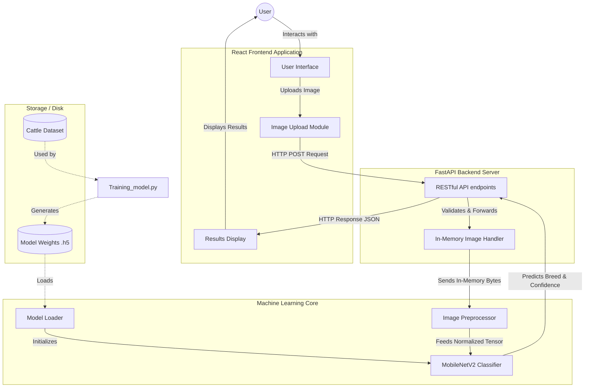

# Project Report: Cattle Breed Classification System

## 1. Abstract
The accurate identification of cattle breeds is a crucial component of modern livestock management and precision agriculture. This project presents an end-to-end Machine Learning web application designed to classify various Indian cattle breeds from images. By leveraging Transfer Learning with the MobileNetV2 architecture, the system achieves high accuracy while maintaining computational efficiency. The solution features a decoupled architecture, incorporating a centralized ML Core, a high-performance FastAPI backend, and a modern React-based frontend to provide an intuitive user experience for single and multi-image breed prediction.

## 2. Introduction
### 2.1 Problem Statement
In the agricultural sector, specifically in livestock farming, identifying cattle breeds accurately is essential for breeding programs, health monitoring, and market valuation. Manual identification relies heavily on human expertise, which can be subjective, time-consuming, and error-prone. There is a need for an automated, reliable, and accessible tool that can accurately classify cattle breeds using computer vision.

### 2.2 Objectives
* To develop a deep learning model capable of accurately classifying various Indian cattle breeds from images.
* To implement a centralized machine learning core utilizing Transfer Learning (MobileNetV2).
* To construct a robust and scalable backend API using FastAPI for serving model predictions.
* To design a user-friendly frontend interface using React for seamless interaction and image uploading.
* To ensure the system is maintainable, adhering to DRY (Don't Repeat Yourself) principles and clean architecture.

## 3. Dataset Description
The project utilizes the **Indian Cattle Image Dataset** (sourced from Kaggle). This dataset comprises categorized folders containing images of various distinct Indian cattle breeds (such as Amritmahal, Gir, etc.). The dataset is organized in a hierarchical directory structure where each subdirectory represents a specific breed class, facilitating dynamic reading and automatic class registration by the model.

*(Note: Example image illustrating cattle in an agricultural setting.)*

## 4. Methodology
The methodology involves several key phases: data ingestion, preprocessing, model selection, fine-tuning, and inference.

### 4.1 Data Preprocessing
Images uploaded to the system or fed during training are processed using OpenCV and NumPy. The images are:
* Resized to standard dimensions required by the MobileNetV2 input layer (e.g., 224x224 pixels).
* Normalized to scale pixel values appropriately, enhancing model convergence during training and accuracy during inference.

### 4.2 Transfer Learning with MobileNetV2
To achieve high accuracy with a limited dataset, the project utilizes **Transfer Learning**. 
* **Base Model:** MobileNetV2, pre-trained on the ImageNet dataset, is used as the base feature extractor. MobileNetV2 is chosen for its optimal balance between performance and computational efficiency (lightweight architecture).
* **Custom Classification Head:** The top classification layers of the original MobileNetV2 are replaced with a custom Dense neural network layer tailored to output the probabilities for the specific number of cattle breeds present in the dataset.

### 4.3 Model Training and Evaluation
The model is trained using a categorical cross-entropy loss function and optimized via an appropriate optimizer (e.g., Adam). The `Training_model.py` script facilitates the local training process. The trained weights are subsequently saved as `livestock_mobilenetv2.weights.h5` to be loaded dynamically during inference without needing to retrain.

## 5. System Architecture
The system follows a client-server architecture, distinctly separating the frontend presentation, backend logic, and the machine learning inference engine.

### 5.1 Architecture Diagram

### 5.2 System Components
1. **Frontend (React):** A modern, responsive web interface that allows users to upload single or multiple images. It handles HTTP requests to the backend and dynamically renders the classification results (breed name and confidence score).
2. **Backend (FastAPI):** A high-speed, asynchronous REST API. It handles incoming image files, processing them in-memory to reduce disk I/O bottlenecks, and routes them to the ML Core for inference.
3. **ML Core (`ml_core.py`):** A centralized Python module housing all machine learning logic. It defines the model architecture, loads the pre-trained weights, and contains the preprocessing pipeline, ensuring consistency across backend serving and local testing.

## 6. Technologies Used
* **Deep Learning Framework:** TensorFlow / Keras (MobileNetV2)
* **Computer Vision:** OpenCV (`cv2`), NumPy
* **Backend Server:** FastAPI, Uvicorn, Python 3.8+
* **Frontend Application:** React, JavaScript, Node.js 18+
* **Data Format:** JSON (for API communication)

## 7. Implementation Highlights
* **Decoupled Architecture:** By separating the `ml_core.py` from `app.py` (FastAPI), the system ensures that the API logic and ML logic can be maintained and scaled independently.
* **In-Memory Processing:** The backend utilizes FastAPI's `UploadFile` to read image streams directly into memory, converting them to NumPy arrays for immediate prediction. This avoids latency associated with writing temporary files to disk.
* **Dynamic Breed Registration:** The system dynamically infers the target breed classes based on the folder structure in the `cattle/` directory, making the pipeline adaptable to new datasets without hardcoding class names.

## 8. Conclusion
The Cattle Breed Classification System successfully demonstrates the application of deep learning in precision agriculture. By combining the power of MobileNetV2 for feature extraction with a modern web stack (React and FastAPI), the project delivers a fast, accurate, and user-friendly tool for livestock identification. The clean, decoupled architecture ensures that the project is highly maintainable and serves as a robust foundation for future enhancements.

## 9. Future Work
* **Dataset Augmentation:** Incorporating more diverse images across different lighting conditions and angles to improve the model's generalization capabilities.
* **Mobile Application:** Porting the React frontend to React Native to provide farmers with a dedicated mobile application for on-the-field identification.
* **Deployment:** Containerizing the application using Docker and deploying it to a cloud platform (e.g., AWS, GCP) to ensure global accessibility and scalability.
* **Continuous Integration/Continuous Deployment (CI/CD):** Implementing automated testing and deployment pipelines for streamlined updates.
